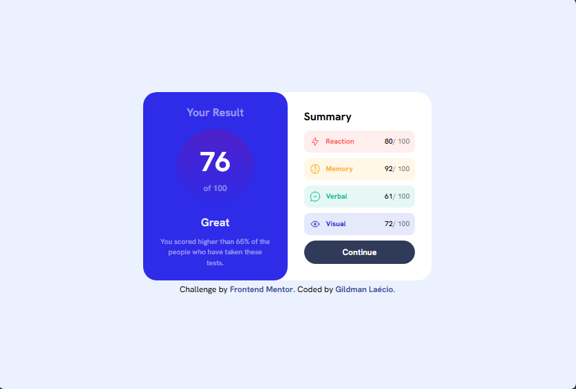
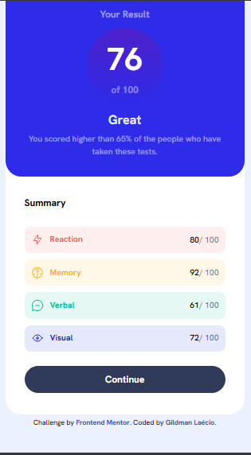

# results-summary-component-main
 results-summary-component-main

This is a solution to the [Results-summary-component-main challenge on Frontend Mentor](https://www.frontendmentor.io/challenges/results-summary-component-CE_K6s0maV). Frontend Mentor challenges help you improve your coding skills by building realistic projects. 

## Table of contents

- [Overview](#overview)
  - [Screenshot](#screenshot)
  - [Links](#links)
- [My process](#my-process)
  - [Built with](#built-with)
  - [What I learned](#what-i-learned)
  - [Continued development](#continued-development)
- [Author](#author)

## Overview

### Screenshot

These are my screenshots showing how the project turned out.

- For desktop version:



- For mobile version:



### Links

- Solution URL: [My Solution](https://gillaercio.github.io/results-summary-component-main/)

## My process

### Built with

- Semantic HTML5 markup
- CSS custom properties
- Grid Layout
- Mobile-first workflow
- Javascript
- JSON

### What I learned

I took advantage of this project to practice the use of **JavaScript** and **JSON**:

Loading .json file and placing it in predefined location.

```javascript
  <script>
    function load() {
      fetch('data.json')
        .then(response => response.json())
        .then(dados => {
          const container = document.querySelector(".summaries")
          
          dados.map(dado => {
            const totals = document.createElement("div")
            totals.classList.add("totals")
            totals.classList.add(dado.category)

            const total = document.createElement("div")
            total.classList.add("total")
            total.classList.add(`total${dado.category}`)

            const img = document.createElement("img")
            img.src = dado.icon
            img.alt = `icon-${dado.category}`
            const name = document.createElement("span")
            name.textContent = dado.category
            
            const percent = document.createElement("div")
            percent.classList.add("totalPercent")
            const dataSpan = document.createElement("span")
            dataSpan.textContent = dado.score
            const textSpan = document.createElement("span")
            textSpan.textContent = '/ 100'

            total.appendChild(img)
            total.appendChild(name)
            total.appendChild(percent)
            percent.appendChild(dataSpan)
            percent.appendChild(textSpan)

            totals.appendChild(total)
            totals.appendChild(percent)

            container.appendChild(totals)

          })
        })
      }

    load()
  </script>
```

### Continued development

I will definitely look for more projects with **JavaScript** and **JSON** to continue improving.

## Author

- Frontend Mentor - [@gillaercio](https://www.frontendmentor.io/profile/gillaercio)
- Github - [My Github](https://github.com/gillaercio)
- LinkedIn - [My LinkedIn](https://www.linkedin.com/in/gildman-la%C3%A9rcio/)